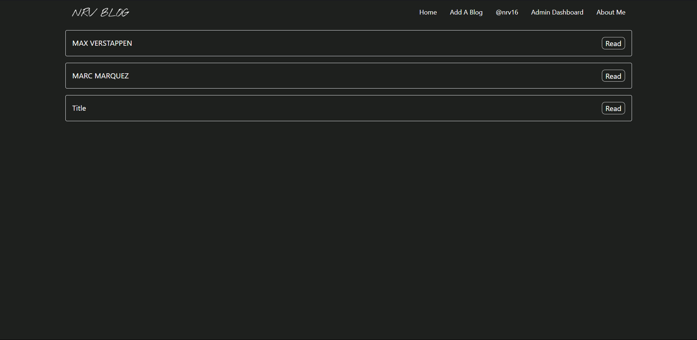
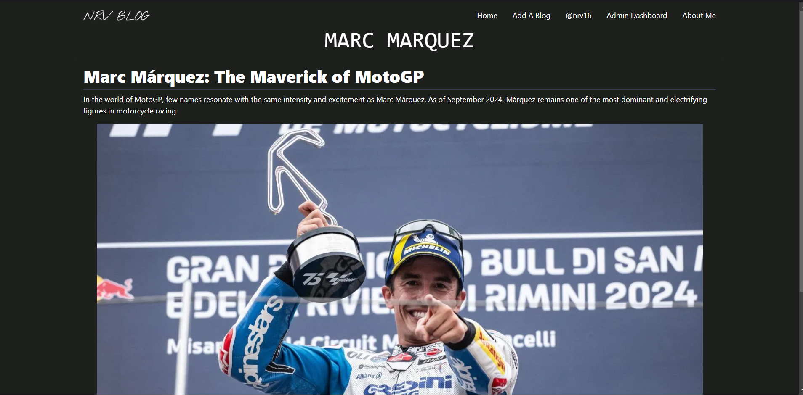
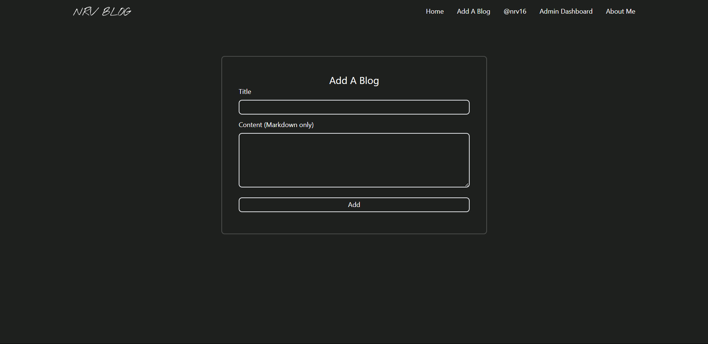
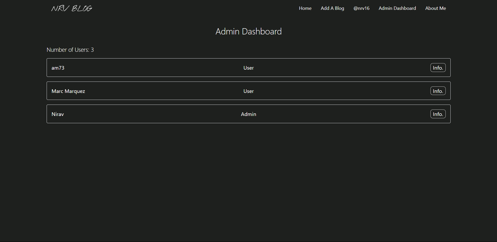
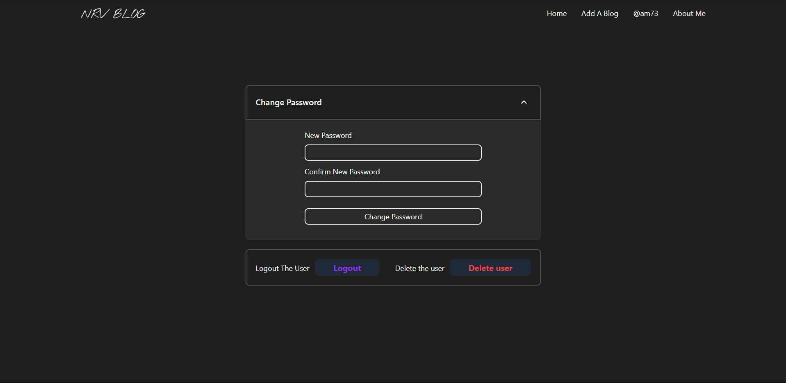
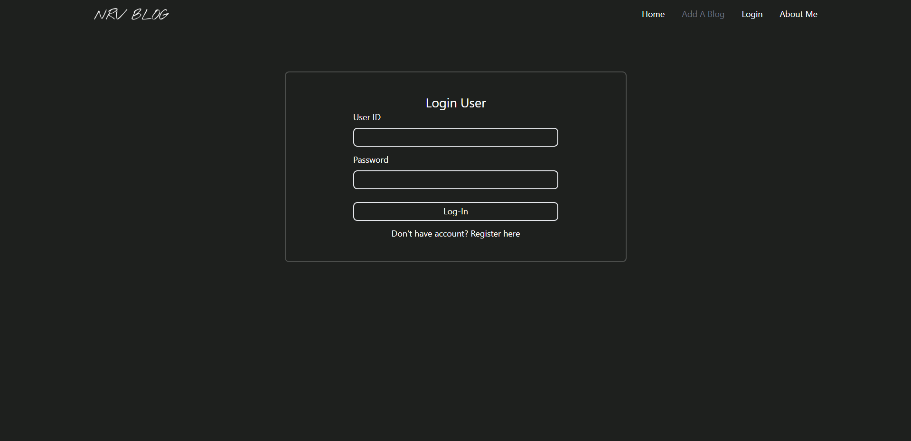
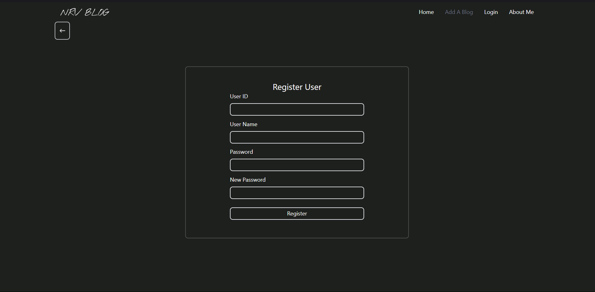
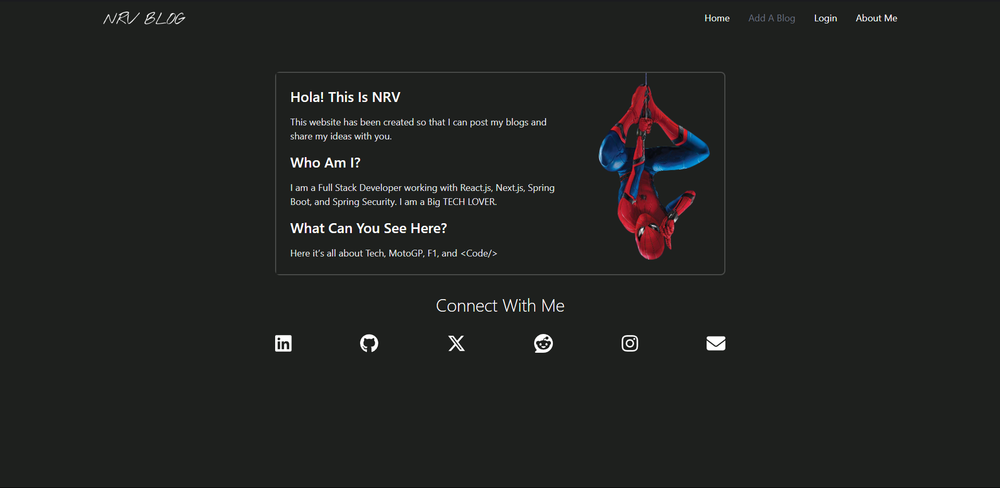

# NRV-BLOG

## 1. Download The Project or Git Clone it.
```
git clone https://github.com/niruparekh09/NRV-Blog
```

## 2. To Run The Project
### To Start Frontend 
```
cd BlogUI
npm i
npm run dev
```
### To Start Backend
```
cd Nrv-Blog-API
mvn clean install
mvn spring-boot:run
```

**Edit `application.properties` with your dbbase link, username and password. You can use environment variables**

**You need to add a user with ROLE_ADMIN in your database in the table named blog once you run the spring boot aplication.** ***You can modify the database configuration from `application.properties` file inside your Application***
## 3. You can also import postman file
### `Nrv-Blog-API.postman_collection.json`


# Demo Images:
## Home

## Blog

## Add A Blog

## Admin Dashboard

## User Dashboard

## Login & Register


## About Me

